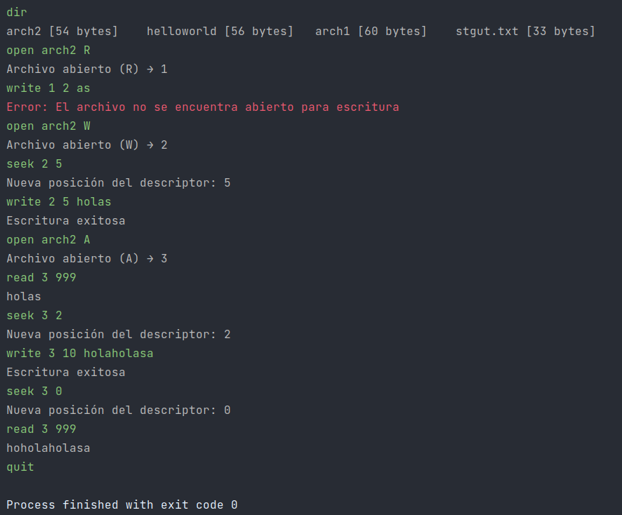

# Implementando la semántica de archivos

    Entrega: 2021.11.30

## Notas relevantes

Se implementó el programa planteado, realizando algunas aseveraciones sobre su comportamiento esperado:

- Cuando se realiza un read o un write, la posición del descriptor se actualizará a donde "terminó" su operación. Es
  decir, en el carácter siguiente al último que se leýo o se escribió.
- No es posible realizar un read en una posición fuera de los límites del archivo.
- Para indicar las posiciones de los descriptores, se utilizaron índices basados en cero.
- Si la cantidad de bytes a leer excede los disponibles desde la posición del descriptor, no se muestra un error, sino
  que se leen los que se encuentran disponibles y se actualiza la posición del descriptor a n, donde n es el tamaño del
  archivo (es decir, apuntará al lugar "vacío" siguiente al último byte del del archivo).

## Ejecución

Para ejecutar el programa, es necesario tener instalada la máquina virtual de Java version 11 o mayor. Si se utiliza el
manejador de paquetes apt, por ejemplo, el siguiente comando cumpliría con la tarea anterior:

      $ sudo apt install default-jre

De igual forma, se recomienda ampliamente instalar el manejador de builds maven. Si se utiliza el manejador de paquetes
apt, por ejemplo, el siguiente comando cumpliría con la tarea anterior:

      $ sudo apt install maven

Para compilarlo y ejecutarlo, tomando en cuenta que el directorio en el que se encuentra es el directorio raíz del
proyecto, es posible utilizar los siguientes comandos:

      $ mvn package assembly:single
      $ java -jar target/SantiagoDiego-UgaldeArmando-1.0-SNAPSHOT-jar-with-dependencies.jar

El primer comando se encarga de compilar el proyecto a un archivo jar, colocándolo en el directorio target.

## Captura de la ejecución del programa

